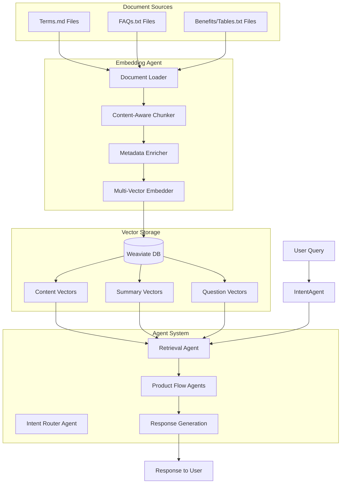

# Insurance Agents Architecture

## System Overview



## Agent Details

### 1. Embedding Agent (Implemented ✅)

The Embedding Agent is responsible for transforming raw insurance documents into searchable vector representations.

#### Components:

1. **Document Loader**
   - Scans source directory for insurance documents
   - Groups documents by product type
   - Maintains document metadata

2. **Content-Aware Chunker**
   - **Markdown Chunker**: For Terms documents (hierarchical splitting)
   - **FAQ Chunker**: For FAQ documents (Q&A pair extraction)
   - **Benefits Table Chunker**: For Benefits documents (line-by-line parsing)

3. **Metadata Enricher**
   - Generates summaries using Gemini LLM
   - Creates hypothetical questions
   - Adds contextual metadata

4. **Multi-Vector Embedder**
   - Content embeddings (direct text representation)
   - Summary embeddings (concise summaries)
   - Question embeddings (hypothetical questions)

### 2. Vector Indexing Agent (Planned)

Will manage ongoing vector database operations:
- Index updates and maintenance
- Vector optimization
- Performance monitoring
- Backup and recovery

### 3. Intent Identification Agents (Planned)

#### General Intent Agent
- Classifies user queries into categories
- Routes to appropriate flow agents
- Handles ambiguous queries

#### Purchase Intent Agent
- Detects buying signals
- Triggers sales workflows
- Tracks conversion funnel

### 4. Product Flow Agents (Planned)

Specialized agents for each insurance product:
- **Travel Flow Agent**: Handles travel insurance queries
- **Maid Flow Agent**: Processes domestic helper insurance
- **Family Flow Agent**: Manages family protection plans
- **Home Flow Agent**: Handles home insurance queries
- **Early Flow Agent**: Processes early/critical illness insurance
- **Car Flow Agent**: Manages motor insurance queries
- **Hospital Flow Agent**: Handles hospitalization insurance

### 5. Utility Agents (Planned)

#### Policy Summarizing Agent
- Generates concise policy summaries
- Highlights key benefits
- Creates comparison tables

#### Policy Comparison Agent
- Compares multiple policies
- Identifies differences
- Recommends best fit

#### Question Generation Agent
- Creates follow-up questions
- Generates clarifying queries
- Builds FAQ databases

#### Retrieval Agent
- Performs intelligent search
- Ranks results by relevance
- Handles multi-modal queries

#### Response Generation Agent
- Formats search results
- Generates natural responses
- Personalizes communication

## Data Flow

1. **Ingestion Phase**
   ```
   Raw Documents → Embedding Agent → Vector Database
   ```

2. **Query Phase**
   ```
   User Query → Intent Agent → Retrieval Agent → Flow Agent → Response Agent → User
   ```

3. **Learning Phase**
   ```
   User Feedback → Question Generation → Vector Update → Improved Retrieval
   ```

## Technology Stack

- **Language**: Python 3.8+
- **Vector Database**: Weaviate
- **Embeddings**: Google Gemini (gemini-embedding-001)
- **LLM**: Gemini 2.5 Flash
- **Framework**: Custom agent architecture

## Deployment Considerations

1. **Scalability**
   - Horizontal scaling of agent instances
   - Load balancing for high traffic
   - Caching for frequent queries

2. **Security**
   - API key management
   - Data encryption at rest
   - Secure communication channels

3. **Monitoring**
   - Query performance metrics
   - Agent health checks
   - Error tracking and alerting

4. **Updates**
   - Document refresh pipeline
   - Model version management
   - A/B testing capabilities

## Intent Router Agent

### Purpose
The Intent Router Agent serves as the intelligent switchboard operator for the HLAS insurance system. It analyzes user queries to understand their primary goal and routes them to appropriate specialized agents.

### Core Responsibilities
1. **Intent Classification**: Categorize user queries into 5 primary intent types
2. **Product Identification**: Recognize which insurance products are relevant
3. **Entity Extraction**: Extract key concepts and terms from queries
4. **Purchase Intent Detection**: Identify buying signals
5. **Structured Output**: Generate JSON commands for orchestration

### Intent Types
- **PRODUCT_INQUIRY**: Questions about specific product features, benefits, or terms
- **COMPARISON_INQUIRY**: Comparing two or more products or features
- **PURCHASE_INQUIRY**: Clear intent to buy, get quotes, or start applications
- **GENERAL_INQUIRY**: Non-product-specific questions about company, claims, etc.
- **CHITCHAT**: Greetings, thanks, or casual conversation

### Supported Products
- **Car** (Car Protect360)
- **Early** (Early Protect360 Plus)
- **Family** (Family Protect360)
- **Home** (Home Protect360)
- **Hospital** (Hospital Protect360)
- **Maid** (Maid Protect360 PRO)
- **Travel** (Travel Protect360)

### Product Alias Recognition
The agent recognizes 50+ aliases including:
- vehicle, auto, automobile → Car
- domestic helper, helper, FDW → Maid
- house, property → Home
- medical, health → Hospital
- trip, vacation, overseas → Travel

### Output Schema
```json
{
  "primary_intent": "COMPARISON_INQUIRY",
  "product_focus": ["Family", "Hospital"],
  "entities": ["medical expense", "coverage"],
  "is_purchase_intent": false,
  "original_query": "What's the difference in medical expense coverage between Family and Hospital plans?"
}
```

### Routing Logic
- **PRODUCT_INQUIRY** + products → Product-specific Agent(s)
- **COMPARISON_INQUIRY** + products → Comparison Agent
- **PURCHASE_INQUIRY** + products → Sales Agent
- **GENERAL_INQUIRY** → Customer Service Agent
- **CHITCHAT** → Conversational Agent

### Technical Implementation
- **LLM**: Gemini 2.5 Flash with structured prompting
- **Hybrid Approach**: LLM classification + rule-based enhancements
- **Error Handling**: Multiple fallback mechanisms
- **Performance**: 94.7% accuracy on comprehensive test suite

## Retrieval Agent

### Purpose
The Retrieval Agent serves as the librarian of the system, finding the most relevant document chunks from Weaviate using sophisticated multi-vector hybrid search strategies. It doesn't write answers; it finds the right information.

### Core Responsibilities
1. **Precision**: Use filtering to narrow search space to relevant products
2. **Relevance**: Use multi-pronged search strategy for semantic matching
3. **Advanced Search**: Execute hybrid vector + keyword search
4. **Re-ranking**: Apply cross-encoder models for maximum accuracy

### Input/Output Schema

#### Input
- **RetrievalRequest**: Contains intent classification from Intent Router
- **top_k**: Number of chunks to retrieve (default: 5)
- **search_strategy**: Strategy to use (multi_vector, hybrid, content_only, etc.)

#### Output
```json
[
    {
        "content": "The policy provides unlimited windscreen cover, with a $100 windscreen excess applied...",
        "product_name": "Car",
        "document_type": "Benefits",
        "source_file": "Car_Tables.txt",
        "section_hierarchy": ["Windscreen Cover"],
        "relevance_score": 0.92,
        "search_method": "multi_vector_hypothetical_question_embedding"
    }
]
```

### Search Strategies

#### Multi-Vector Search (Default)
Searches across three embedding types with weighted scoring:
- **Hypothetical Questions** (60% weight): Matches user queries to pre-generated questions
- **Summary Embeddings** (25% weight): Matches to document summaries
- **Content Embeddings** (15% weight): Direct content matching

#### Hybrid Search
Combines vector similarity with keyword matching (BM25) for:
- Specific insurance terms (NCD, excess, premium)
- Monetary values and percentages
- Product names and acronyms

#### Specialized Searches
- **Content Only**: Pure vector search on document content
- **Summary Only**: Search against AI-generated summaries
- **Questions Only**: Search against hypothetical questions

### Advanced Features

#### Product Filtering
- Automatically filters results based on Intent Router product focus
- Supports single product: `["Car"]` or multi-product: `["Car", "Travel"]`
- Falls back to cross-product search for general inquiries

#### Query Enhancement
- Expands insurance abbreviations (NCD → "no claim discount")
- Adds entity context from Intent Router
- Normalizes product aliases

#### Re-ranking Pipeline
1. **Initial Retrieval**: Get top_k × 3 candidates from Weaviate
2. **Cross-Encoder Scoring**: Use MS-Marco MiniLM model for precise relevance
3. **Score Combination**: Weighted average of vector score (30%) + rerank score (70%)
4. **Final Selection**: Return top_k highest-scoring chunks

### Performance Characteristics
- **Multi-Vector Precision**: Leverages three complementary embedding types
- **Semantic Understanding**: Goes beyond keyword matching
- **Product Awareness**: Intelligent filtering based on intent
- **Relevance Optimization**: Cross-encoder reranking for accuracy
- **Scalable**: Handles 650+ document chunks efficiently

### Technical Implementation
- **Vector Database**: Weaviate with multi-vector support
- **Embeddings**: Gemini embedding-001 (3,072 dimensions)
- **Cross-Encoder**: MS-Marco MiniLM-L-6-v2 for reranking
- **Search Types**: Vector, hybrid (BM25 + vector), keyword
- **Filtering**: Post-search product filtering with expansion capability

## Response Generation Agent

### Purpose
The Response Generation Agent serves as the "voice" of the system, synthesizing retrieved context chunks into high-quality, human-readable answers that directly address user queries. It acts as the final step in the agent pipeline, transforming raw document chunks into polished customer responses.

### Core Principles
1. **Grounded in Truth**: Responses based exclusively on provided context, never external knowledge
2. **Clarity and Simplicity**: Clear, direct language that customers can understand
3. **Traceability and Trust**: Every fact cited with source references
4. **Honesty about Limitations**: Admits when context is insufficient rather than guessing

### Input/Output Schema

#### Input
- **ResponseRequest**: Contains original query and retrieved context chunks
- **original_query**: User's exact question
- **context_chunks**: List of ChunkResult objects from Retrieval Agent
- **citation_style**: Format for citations (numbered, inline, footnote)

#### Output
```json
{
    "answer": "The windscreen excess for car insurance is $100 [1]. This applies to windscreen replacement or repair coverage [1].",
    "citations": [
        {
            "id": "cite_1",
            "product_name": "Car",
            "document_type": "Terms",
            "source_file": "Car_Terms.txt",
            "section_hierarchy": ["Windscreen Cover"],
            "relevance_score": 0.95
        }
    ],
    "confidence_score": 0.92,
    "context_used": 1,
    "context_available": 3,
    "has_sufficient_context": true,
    "reasoning": "Used 3 context chunks from 1 product(s): Car | Average relevance score: 0.85 | Assessment: Sufficient context available"
}
```

### Response Generation Process

#### Step 1: Context Validation
- Checks if any relevant context chunks are available
- Returns "no context" response if retrieval found nothing relevant

#### Step 2: Citation Creation
- Converts ChunkResult objects into Citation objects
- Assigns unique IDs and formats source information
- Preserves relevance scores and document hierarchy

#### Step 3: Context Preparation
- Formats context chunks with citation markers for LLM
- Includes source information and content for each chunk
- Structures data for optimal LLM comprehension

#### Step 4: Answer Generation
- Uses Gemini 2.0 Flash with low temperature (0.1) for factual responses
- Provides strict instructions to only use provided context
- Enforces citation requirements for every fact mentioned
- Handles multiple products with clear distinctions

#### Step 5: Quality Assessment
- Calculates confidence score based on context relevance and answer quality
- Assesses context sufficiency using uncertainty indicators
- Tracks which citations were actually used in the response
- Generates reasoning about response quality

### Advanced Features

#### Citation Styles
- **Numbered**: [1], [2], [3] - Default style for clear reference tracking
- **Inline**: (Source: Car Insurance Terms) - Descriptive source information
- **Footnote**: ¹, ², ³ - Academic-style superscript notation

#### Confidence Scoring
- Base score from average relevance of context chunks
- Boosted for specific details (monetary values, dates, percentages)
- Reduced for uncertainty phrases or very short answers
- Range: 0.0 to 1.0 with automatic normalization

#### Context Sufficiency Assessment
- Analyzes answer for uncertainty indicators
- Checks relevance scores of source material
- Ensures answer is substantive (minimum length requirements)
- Flags when additional information may be needed

#### Error Handling
- Graceful degradation when no context is available
- Clear messaging about limitations and next steps
- Fallback responses for API errors or processing failures
- Maintains user trust through honest communication

### Performance Characteristics
- **Response Time**: ~1-3 seconds for typical queries
- **Accuracy**: High fidelity to source documents with citation verification
- **Consistency**: Deterministic responses with low temperature settings
- **Scalability**: Stateless design supports concurrent requests
- **Reliability**: Comprehensive error handling and fallback mechanisms

### Technical Implementation
- **LLM**: Gemini 2.0 Flash with optimized prompting for factual accuracy
- **Temperature**: 0.1 for consistent, factual responses
- **Context Window**: Efficiently manages large context chunks
- **Citation Tracking**: Automatic verification of citation usage
- **Quality Metrics**: Multi-dimensional scoring for response assessment